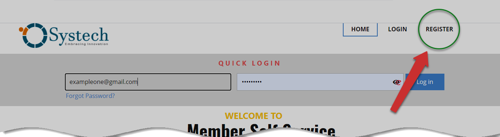

### ACCESSING MSS PORTAL

#### Authentication 

The portal is accessible on any internet-connected device at
**https://www.systechafrica.com.** All visitors are welcomed to the
landing page. This is where members who are already registered can
quickly log in and interact with the system. For those members who have
only been enlisted in the FundMaster, they can officially register
within the portal. The following illustration shows the landing page.

#### Portal landing Page

The circled numbers in this above illustration correspond to the numbers
in the following table that describe the key components of the MSS
portal interface.

| Part            | Description                                        |
| --------------- | -------------------------------------------------- |
| 1. Logo        | This is the identity of the service provider.      |
| 2. Quick Login | This is a shortcut link to the login page when clicked.                                           |
| 3. Login       | This is the link that opens to the login page when clicked.|
| 4. Register    | This is the link that opens to the registration page when clicked.|
| 5. Become a Member   | This is the link that activates a form to capture membership information. |
| 6. Contact Info    | This is the section of the page with contact details. |
| 7. Direction Map | This is a Google map that helps in finding directions to our offices. |

#### Password Verification

All visiting members will land on the landing page as shown below. From
the menu bar, in the upper-right corner, a member can click to LOGIN or
REGISTER as a new user to the portal. Alternatively, a registered member
can also log in from within the page using the QUICK LOGIN section as
illustrated below.

**Action:** Click on the **LOGIN** or **Quick LOGIN** links to access
the portal dashboard.

#### Login Process

#### Step 1

A click on the login link on the portal landing page will open the log
in page, where a user can use his or her username/email and password to
log in.

#### Step 2

In case a use cannot recall his or her password, clicking Reset Password
will allow the user to change the Password.

**Action:** Enter your **Username** or **Email address** and
**Password** and click the **LOG IN** button to access the portal
dashboard. Alternatively, click on reset password in case you can't
remember your password and check **Remember Me** box to save it.

#### Registration Process

*Step 1*

A new member can click the REGISTER link on the Menu Bar as shown in the
illustration below to start the registration process.

**Action:** Click the **Register** link to open the registration form.

*Step 2*

The sign-up page will open to allow the user to register through a form
as shown in the illustration below.

**Action:** Click to select Account Type and type an email address. Then
click **Submit** button to create an account. Otherwise, click
**Cancel** button to terminate.

A user will be prompted to click to select the appropriate account type
through a drop-down menu, and then enter an email address to register.
This is shown in the following illustration.

**Action:** Click on the drop-down menu to select Account Type. Type in
your **email address** and click the **submit** button. Otherwise, click
**Cancel** button to abort the procedure.

The following illustration shows a failed registration with a pensioner
account. The failed attempt, as shown below will prompts the system to
direct the user to the membership section of the landing page where one
can sign-up and become a member. See the following illustration.

**Action:** Click the **Ok** button on the pop-up window to exit.

In the middle of the MSS landing page, there is a button labeled become
a member that a user how has successfully logged into the system can
click to begin the process of registering for membership. See the
illustration below.

**Action:** Click on the **Become Member** Button to launch the
membership form.

Clicking on the **BECOME A MEMBER** button as shown in the above
illustration will take you to another page with a form that is used to
capture all the necessary information from the user pertaining to
joining a scheme that is managed through FundMaster. See the next
illustration.

For a user to successfully log in, he/she ought to be a registered
member in the FundMaster -- the core system. Once a user signs up and
the details are submitted successfully, the member will receive an email
with a password that after verifying, can be used to log into the MSS
portal.

This form prompts the user to fill in the required details for storing
in the FundMaster. Clicking on the Next button on the lower bottom side
of the page will open the next section for filling more details. See the
illustration below.

**Action:** Click on the **Next** Button to launch the membership form,
otherwise click previous to step back.

**Note**

In summary, the above forms will capture detailed information on the
following: Scheme and employer, personal details, contact, place of
birth, home address, and employment. The registering process will also
require some documents like the national ID to be submitted. The process
will be finished upon checking a declaration button. Afterward, the
Principal Officer will verify your account and complete your setup in
core system - FundMaster. After approval, you can register into MSS
Portal using the email you set up.