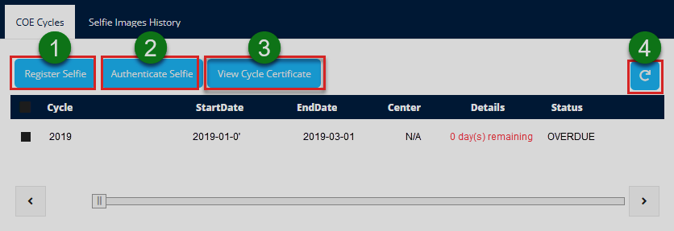
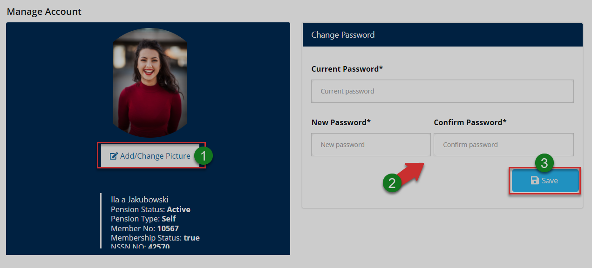

### USER PROFILES

This section will demonstrate how different modules in the MSS portal
work. Note that the portal will configure different dashboards based on
the type of user logged in. This document aims to demonstrate how each
of the different profiles looks and function. After successful login, a
user is allowed access to a corresponding profile. The portal generates
profiles based on the type of user logged in. The following profiles are
accessible:

i. Member profile

ii. Admin profile

iii. Sponsor profile

iv.  Pensioner profile

v. Client Relationship Manager (CRM) profile

vi. Client Relationship Executive (CRE) profile

vii. Admin and Principal Officer (PO) profile

## Member Profile

This profile serves as an interface between the FundMaster and members
of various scheme that are administered using the system. These users
can carry out several activities as will be discussed in this section.
When a user login using a member's account, he/she will be launched into
the member's profile dashboard as shown in the illustration below. Note
the pop-up window that serves to remind of a member's pending tasks such
as uploading missing documents, adding beneficiaries, etc.

**Action:** Clicking the **OK** button to close the pop-up window.

###  Dashboard Components

The following illustration shows the member dashboard that consists of a
menu bar on the left side and a summary of the key information:

The numbered sections in this illustration above correspond to the
numbers in the following table that describe the key components of the
member's dashboard.

| **Part**             | **Description**                               |
|----------------------|-----------------------------------------------|
| 1. Menu Bar          | This is the menu bar from which various menu items can be accessed quickly. Click on the menu bar icon on the top to expand it. |
| 2. Pension Scheme Name | This drop-down menu allows one to select the contribution scheme. |
| 3. Employer Name     | This is a drop-down menu for selecting the employer/sponsor's name. |             |
| 4. FAQ               | This link will open another page displaying the frequently asked questions in the portal. |
| 5. Member Account    | This is where the member's account profile picture and name are displayed on the dashboard. |
| 6. Figures Summary   | This section gives a summary of a member's pension contribution standings i.e., contributions on the employee account, employer account, and the total balance. |
| 7. Request Statement | Clicking on this button will initiate the process of compiling a statement report from the system that is automatically downloaded on the device used. |
| 8.  View Contribution History | Clicking this button will initiate the process of downloading a report from the FundMaster system. |
| 9.  Recent Closing Balance | This section displays a summary of the recent closing balance in form of a tabulation on the left side and a graph projection on the right side.|                                   |
| 10. Recent Contribution | This section of the page shows the recent contributions table. |

### Dashboard Menu

Clicking the menu bar icon will expand the panel to reveal menu items as
shown in the illustration below. The user can click each item to open a
specific page. The menu comprises links to the following pages:

i.  Personal info

ii. Contributions

iii. Balances

iv. Claims

v.  Benefits

vi. Banks

vii. Documents

viii. Forms

ix. Tickets

x.  Manage Accounts

xi. Activity Logs

xii. Log Out Button

**Action:** Click the **Home tab** to expand the menu bar. Otherwise,
click on a **menu item** to open the respective page.

### Personal Info

Clicking the profile info menu will display the member's personal
information as shown in the following illustration.

*Bio and Contact details*

From the left side of the page section, the member can see his/her
personal information (bio) as captured in the system. On the right side
is the member's contact details. Scroll down to display the lower hidden
section.

**Action:** Use the **Scroll Bar** on the right to view the hidden part
of the page.

*Beneficiaries' details*

From the left side, we have the member's beneficiaries presented in a
table while on the right side a chart of the beneficiaries' entitlement
is displayed.

**Action:** Click on the buttons labeled with green numbered circles to
do the following:

-   Label 1: click to repopulate the table.

-   Label 2: click to open a new form to add more beneficiaries.

-   Label 3: click to view employment details.

-   Label 4: click to view all the details.

-   Label 5: click to view and edit individual's details.

The Illustrations below demonstrate how to achieve the click events
listed above:

*Adding more beneficiaries*

Clicking the add beneficiary button as shown in the previous
illustration, will launch a form prompting the user to fill in text
fields with all the details of a beneficiary. See the illustration
below.

**Action:** Click the **Save** button to add a new person. Otherwise,
click the **Close** button exit the window.

*Employment details*

Clicking the employment details button as shown in a previous
illustration, will launch a form displaying the user's employment
details as shown in the illustration below.

**Action:** Click the **Close** button to exit the window.

*Viewing all details*

Clicking the view all details tab will display a page with tabs that can
be clicked to display sections with all details of a member. See the
illustration below.

**Action:** Click on the menu items labeled with green numbered circles
to do the following:

-   Label 1: click to go back to the previous page.

-   Label 2: click to view and edit address information.

-   Label 3: click to view and edit place of birth information.

-   Label 4: click to view and edit permanent home address information.

-   Label 5: click to view and edit employment information.

-   Label 6: click to view and edit membership information.

-   Label 7: click to upload new documents.

-   Label 8: click to commit modified details.

*Address information*

Click to view a member's address information as shown in the
illustration below.

**Action:** Click the **Save** button to commit the captured details

*Place of birth information*

Click to view a member's place of birth info as shown in the
illustration below.

**Action:** Click the **Save** button to commit the edited details

*Permanent home address information*

Click to view a member's home address information as shown in the
illustration below.

**Action:** Click the **Save** button to commit the edited details

*Employment information*

Click to view a member's employment information as shown in the
illustration below.

**Action:** Click the **Save** button to commit the edited details

*Membership information*

Click to view a member's membership information as shown in the
illustration below.

**Action:** Click the **Save** button to commit the edited details

*Upload documents*

Click to upload membership required documents as shown in the
illustration below.

**Action:** Click the **Browse** button to upload documents, Otherwise,
click the **Save** button.

### Contributions

Clicking the contributions menu will open the member's contributions
page allowing the user to view records of the contributions they have
made in the past as well as make new contributions. Note that
contributions for a specified period can be viewed using the filter
button.

**Action:** Click on the **buttons** labeled with green numbered circles
to do the following:

-   Label 1: click to go open a form window and make a contribution; see
    the next illustration.

-   Label 2: click to specify the start date for filtering contribution
    records view.

-   Label 3: click to specify the end date for filtering contribution
    records view.

-   Label 4: click to display filtered records.

-   Label 5: click to repopulate the records without filtering.

*Make contributions*

On clicking the **Make contributions** button labeled 1, a drop-down
menu is displayed to allow a user to select the preferred method of
payment e.g., Mobile Money, as illustrated below. Fill the form with
details to commit a new contribution.

**Action:** Click the **Make Payment** button to initiate the
transaction. Otherwise, click on the **Close** button to exit the
window.

Note

When a user inputs his/her Phone Number and Amount and clicks the **Make
Payment** button, The **Mobile Service Provider** will prompt one to
enter pin number to complete the transaction. A confirmation message
will finally be sent to the user's phone number.

### Balances

Clicking the balances menu will open the member's balances page allowing
the user to view records of balances for different accounting periods.
On the right side is a button that allows the user to view her/his
recent contributions through a pop-up window within the page. See the
next illustration.

**Action:** Click the **Recent Contributions** button labeled 1 to open
the recent contributions window. Otherwise, click on the **Refresh**
button labeled 2 to repopulate the records.

*Recent contributions*

**Action:** Click the **Exit** button to close the recent contributions
window.

### Claims

Clicking the claims menu will open the claims page shown in the
illustration below, allowing the user to initiate a claim towards making
benefits request withdrawal. There is a button on the right side that
enables the user to open a wizard for making the request.

**Action:** Click the **Initiate Claim** button to open a claim wizard
window Otherwise, click the **refresh** button to populate the claim
records.

*Initiating claim*

When a user clicks the initiate claims button, a pop-up window opens,
welcoming the member to a claim process. See the illustration below.

**Action:** Click the **Proceed** button to open a claim wizard window
Otherwise, exit the window.

When a user clicks the Proceed button, a wizard is triggered to populate
the user's details if he/she is a registered member. See the
illustration below.

**Action:** Click the **Next** button to proceed, otherwise, click the
**Cancel** button to terminate the process.

Clicking the Cancel button will prompt the user to confirm his/her
decision to discard the claim. Otherwise, the user is given another
chance to continue with the claim process as shown below.

**Action:** Click the **Yes** button to discard the claim or the **No**
button to continue with the claim process.

*Pending claims*

On the other hand, if a user, who is initiating a claim, has another
pending claim not yet approved, when he/she clicks the **Next** button
as shown in a previous illustration, the system informs the member of a
pending claim as shown in the illustration below.

**Action:** Click the **Ok** button to exit the wizard.

Otherwise, if a non-member clicks the next button, the following message
will be displayed.

**Action:** Click the **Ok** button to quit.

Note

The following are some of the reasons why members of a scheme may
initiate claims for exit. These reasons are provided as a configuration
from the FundMaster by the administrator.

-   Resignation

-   retirement on ill-health,

-   Normal retirement

-   Medical discharge

-   Others

###  Projections

Clicking the projections menu will display the projections page. Here
members can use the **Benefits Projection Calculator** to know how much
they could get were they to exit a scheme at a certain age.

They can also use **What If Analysis** function to know how much **AVC**
they can add on top of monthly contribution to achieve a certain
retirement lump sum.

*Calculating benefits projection*

The illustrations below show the steps taken to calculate the benefits
projection. The form shown below prompts the user to fill in the
required details to show the results.

**Action:** Fill in details and click the **Show Results** button,
otherwise, click **What If Analysis** tab to open the calculator page.

Note

If a given age and the selected reason for exit are agreeable, clicking
the Show Results button will trigger the benefits projection calculator
to return some results as shown in the illustration below.

**Action:** Use the **Scroll Bar** on the right to view the extra
information.

*What If Analysis function*

Below is the section of the page with **What If Analysis** function.
Members can calculate their expected benefits result after filling the
provided form with their details and future assumptions to calculate and
predict future withdrawable balance.

**Action:** Click on the **Calculate** button to launch the function.

The following illustrations demonstrate how to get projections with the
What If Analysis function. Note that the calculations thereof are done
with sampled member data. Also, if this function is not visible on the
projections page, it is configured to be hidden and can be activated
from the admin profile within the portal.

*Calculator interface*

On clicking the Calculate button, the following page will load, wait
till a green message is displayed "saying calculator is ready...'. Now
you can adjust parameters for projections. Consider guidance from the
illustration below.

**Action:** Consider the appropriate action on the areas labeled with
green numbered circles as follows:

-   Label 1: click the home button to go to the projections page.

-   Label 2: view to confirm your background data.

-   Label 3: view to see if the calculator is ready.

-   Label 4: click to adjust parameters appropriately for wide-ranging
    projections.

-   Label 5: click to display another section where you can do advanced
    projections.

-   Label 6: read the disclaimer message

Note

The following are some of the basics that a user needs to grasp in order
to use this tool effectively:

-   At first, adjusting the age leaving the other parameters default
    will display current account funds, similar to Addition Voluntary
    Contribution (AVC).

-   Adjusting the Target lump sum will calculate the AVC required to
    achieve the target at the given age of exit and if you have already
    surpassed the target.

-   Adjusting the Income Replacement Ratio (IRR) will calculate the
    target lump sum and AVC that will enable you to achieve the target
    IRR for at least 10 years.

*Adjusting parameters*

The calculator uses your recent contributions (EE+ER+AVC) to project and
determine the amount of lump sum package and IRR that you may receive at
the specified exit age. The financial constraints passed will be applied
accordingly. See the next illustration.

**Action:** Consider the appropriate action on the areas labeled with
green numbered circles as follows:

-   Label 1: click and drag the slider to adjust parameters
    appropriately for wide-ranging projections.

-   Label 2: see the outcome of parameter adjustments

-   Label 3: click to toggle button to unhide parameter adjustments for
    advanced projections

*Advanced projections*

Clicking on the advanced toggle button will unhide a section with
advanced parameters that a user can adjust to project Future Investment
Return Per Annum (%), Future Inflation Per Annum (%), and Future Salary
Increases Per Annum (%). See the illustration below.

**Action:** Click on the red-colored sliders to adjust different
parameters and see the output on the right side of the page as shown
above.

Note

After adjusting the parameters as shown in the illustration below,
consider the right column of the previous illustration to see changes in
projections.

### Documents

Clicking the documents menu will display the documents page that
consists of three sections namely: Unsubmitted documents, submitted
documents, and D.M.S. See the illustration below.

-   Unsubmitted documents sections shows those that a member is supposed
    to upload to the FundMaster for approval.

-   Submitted documents section show those that the member has uploaded
    to FundMaster. These are labeled as either rejected, pending,
    approved, etc.

-   D.M.S on the other hand is a section for easily managing and sharing
    documents.

*Unsubmitted documents*

From this page, a user can also open the submitted documents or D.M.S
pages by clicking the tabs on the top panel. Otherwise, a member can
pick a document from those that are already uploaded or upload a new one
as illustrated below.

**Action:** Click on the tabs and buttons labeled with green numbered
circles to do the following:

-   Label 1: click to select a document from the uploaded list.

-   Label 2: click to select documents to upload from your device

-   Label 3: click to upload a new document.

*Submitted documents*

Clicking the submitted documents tab will display the list of all the
documents already submitted to the system towards initiating a claim.
The user can also open the unsubmitted documents page again or the D.M.S
pages. The illustration below shows the page whose member has no
submitted documents.

**Action:** click the **Refresh** button to repopulate the records.

*Document management system*

Clicking the D.M.S tab will display the list of all the documents that
the member has already uploaded to the system towards initiating a
claim. The user can also open the received documents page to see a list
of documents received by the FundMaster system.

**Action:** Click on the **tabs** and buttons labeled with green
numbered circles to do the following:

-   Label 1: click view unsubmitted documents.

-   Label 2: click to view submitted documents.

-   Label 3: click to view received documents.

-   Label 4: click to select documents to upload from your device

-   Label 5: click to upload a new document.

-   Label 6: click to repopulate the records

*Received documents*

Clicking the Received Documents tab will display the list of all the
documents that the system has already received towards initiating a
claim.

**Action:** Click the **Sort** button to display records in the desired
order.

### Ticket

Clicking the ticket menu will display the tickets page shown below. From
this page, users can raise problems pertaining to usage of the portal.
The system will route the issue to the relevant profile user. For
example, whenever a user raises a ticket for a forgotten password,
seeing that the resetting of passwords is handled from the admin
profile, the portal admin will see the ticket query and address it,
giving a response thereafter.

**Action:** Click on the tabs and buttons labeled with green numbered
circles to do the following:

-   Label 1: click to view a selected ticket's details.

-   Label 2: click and type a ticket ID to do a quick search.

-   Label 3: click to view documents accompanying a selected ticket

-   Label 4: click to refresh records.

-   Label 5: click to add a new ticket

*View ticket*

If a user wants to view all the details of a particular ticket, he/she
is supposed to select by clicking on the check box as shown in the
previous illustration.

After the ticket is selected, clicking the view ticket button will open
a page displaying the ticket's details: Ticket title, ticket status and
message and the replays to the message showing the name of the person
who handled the ticket and the date. On the lower section of the page,
the user can replay the message from the ticket handler. See the
illustration below.

**Action:** Click the tabs and buttons labeled with green numbered
circles to do the following:

-   Label 1: click to return to the previous page.

-   Label 2: click to view if the ticket issue has been resolved.

-   Label 3: click to submit a replay message.

Note

Using the **search by ID** text box will allow you to quickly find a
particular ticket record. On the other hand, clicking on the view
documents button will open the documents page to show all documents
attached to a ticket.

###  Banks

Clicking the bank menu will display the page where a member can add bank
details. If one has more than one bank account, setting one has the
default bank is done here.

**Action:** Click the buttons labeled with green numbered circles to do
the following:

-   Label 1: click to add bank details.

-   Label 2: click to set a selected bank as default.

-   Label 3: click to repopulate records.

### Forms

Clicking the form menu will display a page showing all uploaded forms
for member's profile in the portal. A member can download the form to
fill in and submit appropriately. See the illustration below.

**Action:** Click the **Refresh** buttons to repopulate the list of
forms. Otherwise, click on the **Download file** link to have a copy of
the form on your device.

### Manage Account

Clicking the manage account menu will open a page showing the personal
details of the logged-in member. One can also change his/her profile
picture, download membership certificate besides changing password
details as shown in the illustration below.

**Action:** Click the buttons labeled with green numbered circles to do
the following:

-   Label 1: click to change profile picture.

-   Label 2: click to download membership certificate.

-   Label 3: click to fill in new password details.

-   Label 4: click to confirm all changes.

*Account picture*

Clicking **Add/Change Picture** button will open a window as shown in
the illustration below. One can navigate to the folders or other
locations to upload a new picture.

**Action:** Click the **Browse** button to select a new picture from
your device then click the **Save** to confirm change of images.
Otherwise, close the window.

*Membership certificate*

Clicking the **view membership certificate** button will open a window
as shown in the illustration below, asking one to confirm his/her
intention to view the report.

**Action:** Click the **Yes** button to have the report downloaded to
your device, Otherwise, click the **No** button to abort the procedure.

### Activity Logs

Clicking the activity logs menu will open a page showing a record of all
the activities of a logged-in member in the portal. One can search
records for specific periods through filtering by date and print a copy.

**Action:** Click the buttons labeled with green numbered circles to do
the following:

-   Label 1: click to reload the activity records.

-   Label 2: click to set start and end dates for filtering.

-   Label 3: click to filter.

-   Label4: click to type keywords to search records quickly.

-   Label 5: click to print records.

## Admin Profile

This profile serves as an interface to the portal users who take the
role of administration. Admins have many privileges in the system that
allows them to more functions thus can carry out several activities as
will be demonstrated throughout this section.

### Dashboard components

When a user login as an admin, he/she will be welcomed into the admin
home (dashboard) as shown in the illustration below.

The numbered sections in this illustration above correspond to the
numbers in the following table that describe the key components of the
member's dashboard.

| **Part**         | **Description**                                   |
|------------------|---------------------------------------------------|
| 1.  Menu Bar     | This is the menu bar from which various items can be accessed quickly. Click on the menu bar icon on the top to expand it. |
| 2.  Forms        | A shortcut to view all form documents in the system. |
| 3.  FAQs         | A shortcut to view all frequently asked questions |
|                  | in the portal.                                    |
| 4.  User Account | This is where the member's selfie and name are displayed on the dashboard. Here, a drop-down menu is also provided with links to user profile, notifications and log out button. |
| 5.  Sessions Summary | This section gives a summary of all sessions in the portal: summaries in figures and a graph plotted with the same data. |
| 6.  View Details | This section gives a summary of the portal: Details of all users logged in are provided. |

### Dashboard menu

Clicking the menu bar icon will expand the panel to reveal menu items as
shown in the illustration below. The user can click each item to open a
specific page. The menu comprises links to the following pages:

i.  System Config Files

ii. Users

iii. Manage Admins

iv. Files

v.  Manage Tickets

vi. Settings

vii. Notifications

viii. FAQs

ix. Log Out Button.

**Action:** Click the **Home tab** to expand the menu bar. Otherwise,
click on a **menu item** to open the respective page.

### System Config Files

Clicking the system config files menu will open a page showing all
configurable settings groups under different tabs on the menu bar as
shown in the illustration below.

Note

From this page, an admin can configure different settings allowing close
platform integration through APIs. A good example is integrating the MSS
portal with mobile money platforms such as MPESA etc. The settings also
allow hiding off (can be made visible again) some functionalities on
different profiles as will be demonstrated in this section.

*Changing landing page content*

The landing page of every deployment of the MSS portal can vary from
another by simply editing the various elements of the page e.g. logo,
images, address details among others. The following illustration shows
an example of landing page configuration settings.

**Action:** Click the **Edit** buttons inside every enclosed section to
modify the content appropriately.

*Configs*

Clicking the configs tab will open a section where a user can select
between creating a mobile configuration, viewing a configuration's
settings (which will be displayed on a new window form), or removing a
configuration. See the illustration below.

**Action:** Click on each enclosed tab to carry out the appropriate
action.

*MobileMoney Configs*

Clicking this tab will open a section where a user can configure
settings for integration with mobile money service providers. A user can
also view an existing mobile money configuration or remove one from the
system. See the illustration below.

**Action:** Click on each enclosed tab to carry out the appropriate
action. To view a configuration, first select a record by clicking the
appropriate check box to select and then click view configs button.

*Mail Configs*

Allows a user to configure settings for working with various email
service providers. A user can also view an existing email configuration
or remove one from the system. See the illustration below.

**Action:** Click on each enclosed tab to carry out the appropriate
action. Otherwise, click the **Test SMTP** button.

Note

Clicking the test SMTP button will launch a form prompting the user to
enter an email address for the purposes of testing if the simple mail
transfer protocol is working. See the illustration below.

**Action:** Click the **Send** button to send a test mail to the
provided email account as shown above. After sending, check your email
inbox to see if the mail was successfully delivered.

*SelfieConfigs*

Allows a user to configure settings for selfie identification from the
chosen service provider. A user can also view existing configuration
settings or remove one from the system. See the illustration below.

**Action:** Click on each enclosed tab to carry out the appropriate
action. Otherwise, click the **Refresh** button to reload all the
records.

*Social Page Configs*

Allows a user to configure settings for linking the MSS portal with
various social media websites. A user can also view existing
configuration settings or remove one from the system. See the
illustration below.

**Action:** Click on each enclosed tab to carry out the appropriate
action. Otherwise, click the **Refresh** button to reload all the
records.

### Users

Clicking the user's menu will open a page showing a record of all the
portal users. One can search records for specific periods through
filtering by date. From this page, an admin can carry out several
activities e.g., register new users, lock a user account, filter
records, etc. as will be demonstrated in this section.

**Action:** Click on the text fields and buttons labeled with green
numbered circles to do the following:

-   Label 1: click to open a window with the selected user's details.

-   Label 2: click to display a drop-down menu and select a registration
    action to take.

-   Label 3: click to display a drop-down menu of actions that can be
    taken on a selected user.

-   Label 4: click to do a quick search of the records.

-   Label 5: click to do filter and display users by their profiles.

-   Label 6: click select a criterion to filter users and then click
    view report.

-   Label 7: click to refresh records to default.

*View a user*

Clicking the view users after selecting a record from the list will open
a new window with a form populated with the user's (admin account)
details. See the illustration below.

**Action:** Click the **Close** button to shut the form.

*Registration actions*

Clicking the Registration Actions tab will open a drop-down menu from
which a user can select an action to take as shown in the illustration
below.

**Action:** Click on a text link to take the appropriate action, e.g.,
to register a user to MSS

*Registering a user to MSS*

When a user clicks the Register a User to MSS link, a form is displayed
prompting for the new user's role and email address as shown below:

**Action:** Click to choose a role, type email address then click the
**Save** button. Otherwise, click **Close** button.

*Registering members in batch*

When a user clicks the Register Members in Batch to MSS link, a new
window is opened prompting the user to download a template to fill in
new members details and upload it. The user can view the successful and
unsuccessful executions. See the illustration below:

**Action:** Click on the text fields and buttons labeled with green
numbered circles to do the following:

-   Label 1: click the Browse button to select the filled template file
    from your device.

-   Label 2: click the Upload and Register Members button to render
    records

-   Label 3: click the Download Template text link to get the template
    on your device.

-   Label 4: click the Unsuccessful tab to view exception messages

-   Otherwise, click the close button to exit the window.

*Unsuccessful registrations*

Clicking on the unsuccessful registration tab will display a list of
failed registrations identified by email used together with an exception
message -- the reason for failed registration. See the illustration
below.

**Action:** Click on the text fields and buttons labeled with green
numbered circles to do the following:

-   Label 1: click Browse button to select the filled template file from
    your device.

-   Label 2: click the Upload and Register Members button to render
    records

-   Label 3: click the Download Template text link to get the template
    on your device.

-   Label 4: click the Successful tab to view messages

-   Otherwise, click the Close button to exit the window.

*Register user selfie*

When a user clicks the Register User Selfie link, a new window is
opened, launching the process. One can register a selfie, re-register
and reset authentication trials. To register a member, search using a
phone number, member number, account number, or national ID. See the
illustration below.

**Action:** Click on the text fields and buttons labeled with green
numbered circles to do the following:

-   Label 1: click to type a member identification method e.g., phone
    number, and press enter on the keyboard.

-   Label 2: click the begin the registration process

-   Label 3: click the re-register

-   Label 4: click the reset authentication trails

*Step by step registration process*

To register a member for selfie identification, begin by searching the
members and complete the process by making payments. The process is
demonstrated by following the steps shown in the following
illustrations.

*Step 1*

**Action:** click to type the identification method e.g., phone number

*Step 2:*

**Action:** click a check box to select the member

*Step 3:*

**Action:** click to register the selfie

*Step 4:*

Once a user clicks the Register Selfie button, the system checks if the
member is already registered if not registered it proceeds to check
payments. It begins by checking if the user had previously paid for the
service else it prompts a user with a stk push via which a payment is
done using any mobile money service e.g., Mpesa. See the illustration
below:

**Action:** click the **Yes** button to proceed to payment, otherwise,
click the **No** button to terminate the process.

In case of a pending payment, the user is notified and prompted to
continue by utilizing that payment or cancel as shown below:

**Action:** click the **Yes** button to proceed to payment, otherwise,
click the **No** button to terminate the process.

*Step 5*

After clicking the **Yes** button as shown previously, another window
opens prompting the user to take a selfie as shown below:

**Action:** click the **Request Camera Access** button to take a selfie
from your device, otherwise, the exit window.

Take a selfie as shown in the illustration below:

**Action:** click the **Yes, use this one** button to upload the
picture, or click **Re-take selfie** button to have a better shot**.**
Otherwise, close the window.

Finally, if the picture was uploaded successful, the following message
will be displayed to the user.

**Action:** click the **close** button to exit the window.

Note

Re-register a Selfie process is the same as the registration process
demonstrated above. On the other hand, **reset authentication trails**
will restart the trail counts for the selfie registration process as
shown below.

**Action:** click the **OK** button to close the window.

**More Actions**

Clicking the More Action drop-down menu will list actions that an admin
can take on a selected user account.

**Action:** Click on the **text links** highlighted above to take the
appropriate action

*Lock User:* Clicking on lock User will freeze an account

**Action:** Click the **OK** button to close the window

*Unlock User:* Clicking Unlock User will unfreeze an account

**Action:** Click the **OK** button to close the window

*Reset User:* Clicking Reset User credentials

**Action:** Click the **OK** button to close the window

*Delete User:* Clicking Delete User will remove an account from the
records. However, a user will have to confirm the action first.

**Action:** Click the **Yes** button to proceed or the **No** button to
cancel the process

The following message will be displayed when a user is successfully
deleted as shown in the illustration below.

**Action:** Click the **OK** button to close the window

### Manage Admin

Clicking the manage admin menu will open a page showing a record of all
the users who play the role of portal administration. One can create a
new admin account, view an account detail, or lock an account. See the
illustration below:

**Action:** Click on the text fields and buttons labeled with green
numbered circles to do the following:

-   Label 1: click to create an admin account.

-   Label 2: click to view a checked admin details.

-   Label 3: click to lock a checked admin account.

-   Label 4: click to repopulate records.

*Create Admin*

To create an admin account, fill the provided form with the required
details. See the illustration below:

**Action:** Click the **Save** button to create an account, Otherwise,
click the **Close** button to exit the window.

A successful account creation process will return the following message
as shown below.

**Action:** Click the **OK** button close the window.

*View Admin*

Clicking on the view admin button will open a dialogue window with the
selected admin's details. The details of the account can also be edited
for updates. See the illustration below:

**Action:** Click the **Save button** to commit changes if the details
were edited. Otherwise, click **Close** button to shut the window.

A successful edited account will return the following message as shown
below:

**Action:** Click the **OK** button close the window

*Lock admin account*

Selecting an account to lock from the list of accounts and clicking the
lock admin account will return the message shown below:

**Action:** Click the **OK** button close the dialogue box

### Files

Clicking the files menu will open a page showing a list of all the files
sent to and from the admin account. The files are grouped into Inbox and
Outbox. From the Outbox, one can send a file to a specified profile in
the portal. See the following illustration.

**Action:** click the **view text link** to download a specific file and
see all the details. Otherwise, scroll to see all the records.

*Outbox*

Clicking the outbox tab will open a window listing all the files sent
from a user's account. See the illustration below.

**Action:** Click on the text fields and buttons labeled with green
numbered circles to do the following:

-   Label 1: click the send a document to a specified profile within the
    portal.

-   Label 2: click to repopulate the records

-   Label 3: click a selected file to download it for viewing.

*Sending files*

Clicking the **send document** button will open a send docs dialogue
window prompting the user to select from a drop-down menu the profile to
send the file to, type a description and upload a file to send. See the
illustration below:

**Action:** Click the **Browse** button to select a file from your
device and the **Upload** button to save the file in the portal.
Otherwise, exit the window.

### Manage Tickets

Clicking the manage tickets menu will open a page showing a list of all
the tickets sent to and from the admin account. From this page, the
management of tickets is realized: from searching for tickets from a
list using keywords to adding new tickets among other activities as
demonstrated in this section. See the illustration below:

**Action:** Click on the text fields and buttons labeled with green
numbered circles to do the following:

-   Label 1: click to see all details of a selected ticket.

-   Label 2: click to type a ticket ID to search it quickly.

-   Label 3: click to see all documents attached to a ticket.

-   Label 4: click to repopulate all records.

-   Label 5: click to add a new ticket.

*View tickets*

Clicking the View Ticket button will open a new window showing more
details about the ticket as shown in the illustration below.

**Action:** Click on the text fields and buttons labeled with green
numbered circles to do the following:

-   Label 1: click to go back to your tickets page.

-   Label 2: click to mark a selected ticket as resolved.

-   Label 3: click to type a replay message.

-   Label 4: click to submit the replay message.

-   Label 5: click to select and view an attached ticket document.

*Resolved tickets*

Clicking the ticket resolved button will mark the selected ticket as
closed

**Action:** Click the **OK** button to exit the window.

Clicking a closed ticket will display the following page

**Action:** Click the **Back** button to go to the tickets page,
otherwise, click **Open Ticket** button to mark the ticket as
unresolved.

Below is the message that is generated when a user clicks on the **Open
Ticket** button:

**Action:** Click the **OK** button to exit.

*Support tickets*

Clicking the support tickets tab display a list of all support tickets
raised for admins to respond to within the portal. A user can select a
ticket record from the list and view details. Besides being able to
search for a ticket using ticket ID, a user can also forward a ticket to
another profile to be handled there. See the illustration below.

**Action:** Click on the text fields and buttons labeled with green
numbered circles to do the following:

-   Label 1: click to see all details of a selected ticket.

-   Label 2: click to type a ticket ID to search it quickly.

-   Label 3: click to see all documents attached to a ticket.

-   Label 4: click to repopulate all records.

*All tickets*

Clicking All Tickets tab will open a window displaying a list of all
tickets raised giving more details about every ticket as shown in the
following illustration.

**Action:** Click on the text fields and buttons labeled with green
numbered circles to do the following:

-   Label 1: click to go back to your tickets page.

-   Label 2: click to see all support tickets.

-   Label 3: click to forward a ticket to a particular profile.

-   Label 4: click to repopulate all records.

*Forwarding tickets*

Clicking the **Forward Ticket** button will generate the following
dialogue box prompting the user to select the target profile from a
drop-down menu.

**Action:** Click the **Submit** button to send the ticket, Otherwise,
click the **Cancel** button.

*Tickets Issues Management*

Clicking the Ticket Issue Management tab will display a list of tickets
and their handlers. A user can also add a ticket among other actions as
shown in the illustration below.

**Action:** Click on the text fields and buttons labeled with green
numbered circles to do the following:

-   Label 1: click to add a ticket issue.

-   Label 2: click to delete a selected ticket.

-   Label 3: click to search a ticket by ID number quickly.

-   Label 4: click to repopulate all records.

### Mail outbox

Clicking the mail Outbox menu will open a page showing a list of all
messages received. One can select a message from the list and view its
details or resend. See the illustration below.

**Action:** Click the **View Details** button to see all the details of
a selected message. Click **Resend** button to resubmit a message again
or the **Refresh** button to repopulate the records.

Message details

Clicking the View Details button will open a window showing the details
of a selected message in the Outbox. See the illustration below.

**Action:** Click the **Close** to exit the window.

### FAQs

Clicking the FAQs tab, on the upper right corner, will open a page
showing a list of the frequently asked questions in the portal. One can
click a record to view full details of frequently asked question and add
a question too. See the illustration below.

**Action:** Click the **Add FAQ** button to type and submit one.
Otherwise, click the **Refresh** button to repopulate the records.

*Adding a FAQ*

Clicking the Add FAQ button will trigger a dialogue window prompting the
user for details pertaining to the question i.e., the title, subtitle,
and the profile to send the question and the explanation. See the
illustration below.

**Action:** Click the **Save** button to send the question. Click the
**Delete** button to discard the process. Otherwise, close the window.

### Activity Logs

Clicking the activity logs menu will open a page showing a record of all
the activities by all users who logged into the portal in the recent
past. One can search records for specific periods through filtering by
date.

**Action:** Click the buttons labeled with green numbered circles to do
the following:

-   Label 1: click to reload the activity records.

-   Label 2: click to set start and end dates for filtering.

-   Label 3: click to filter.

-   Label4: click to type keywords to search records quickly.

### Manage Account

Clicking the manage account menu will a page showing the personal
details of the logged-in user. One can also change the profile picture
and password details as shown in the illustration below.

**Action:** Click the buttons labeled with green numbered circles to do
the following:

-   Label 1: click to change profile picture.

-   Label 2: click to fill in new password details.

-   Label 3: click to confirm all changes.

*Account picture*

Click the add/change picture button as shown in the previous
illustration to upload a picture as shown below.

**Action:** Click the **Browse** button to select a picture from your
device. Then click the **Save** button to upload the image. Otherwise,
close the window.

### Settings

Clicking settings on the menu bar will open a page showing types of
configurations that an administrator can set for different user profiles
in the portal. New profiles can also be added from this page. The
illustrations below demonstrate how different configurations are done.

The following illustration shows the different categories of setting
possible in the portal.

**Action:** Click on the **Text links** labeled with green numbered
circles to do the respective configurations.

#### Permissions

This form enables admins to determine access to various elements that
are configured to be either visible or hidden to the different profile
users. This is simply done by selecting yes or no from the form select
fields for every item listed. The illustration below shows the settings
for a member profile on the portal.

Clicking other tabs, e.g. Principal Officer, on the menu bar will allow
one to modify settings for other profiles. See the illustration below.

**Action:** Click on the **Set Default** button to retain standard
settings or the **Save** button to commit the new changes, if any.

#### Profiles

This form allows the admin to determine the form of identification
method for accessing the different profiles in the portal. A user needs
to select a profile from a list and then choose the login identifier as
shown in the illustration below.

**Action:** Consider the appropriate action on the areas labeled with
green numbered circles as follows:

-   Label 1: click the select a profile.

-   Label 2: click to select preferred login identification method.

-   Label 3: click to save the changes.

-   Label 4: confirm by viewing if the changes have been reflected.

#### Email templates

This form allows the admin to view a list of all email templates created
in the portal and also create a new template that can be used to aid in
communication from within and outside of the portal. See the
illustration below.

**Action:** Click on the **Add/Edit** button to configure a new email
template

*Adding a template*

Clicking the add/edit template button on the previous illustration will
launch a form that allows the user to configure how a new email template
should look like. See the illustration below.

**Action:** Click accordingly to set the configurations for a new email
template. Finally, click the **Save template** button to save the new
template.

#### Security

This form allows the admin to configure security settings for user login
into the portal. Through this form, one is able to enhance login
security by enabling two factor authentication. This is done by
selecting yes or no on the form select fields. The illustration below
shows settings done to activate two factor authentication.

**Action:** Click to select yes or no on the select fields accordingly.

Note

If the security settings above are configured as shown above, any user
who tries to log into the profile will be confronted with the need to
authenticate by keying in a verification code sent through his/her email
account. See the illustration below.

#### Form Configuration

Through this form, the portal admin is able to determine the items
(specific info details) to include on a member form that is used to
correct new member's details as required for one to access the portal.
One can make this determination by just selecting yes or no for every
item listed on the form. The illustration below shows the settings for a
member profile on the portal.

Clicking the beneficiary tab will allow settings for a beneficiary form
-- a form used to capture a pensioner's select beneficiary in the event
he/she dies without receiving all benefits from a pension scheme. The
process is exactly the same as demonstrated for members form. See the
illustration below.

**Action:** Click on the **Set Default** button to retain standard
settings or the **Save button** to commit the new changes, if any.

#### Tooltips

This form allows the admin to determine how toolstip (a pop-up window
giving a piece of advice on how to use a tool on the interface) should
be shown on a profile's dashboard when a user logs in.

The configurations can be set to allow the tooltips to show only the
first time a new user logs into the portal profile or show them
randomly. See the illustration below.

**Action:** Click to select yes or no on the select fields accordingly.

Note

The lading page settings have been covered under system configs file
menu item under the title 'changing landing page content'. Otherwise,
for the Chat Box and Analysis functionalities, our developers are still
working to avail them in due time. Keep checking.

### Forms

Clicking the form link on the upper right corner opens the forms page
listing all forms in the portal. A user can identify a form on the list
by title and description. A button for starting the process of uploading
a form to the portal is provided together with one for deleting unwanted
ones, downloading, and refreshing the records. See the illustration
below:

**Action:** Click the buttons labeled with green numbered circles to do
the following:

-   Label 1: click start the process of adding a form.

-   Label 2: click to delete a selected form on the list

-   Label 3: click to repopulate all records.

Clicking the Upload button will load a dialogue box prompting the user
for the title, file attachment, and the description of the form to be
created. See the illustration below:

**Action:** Click the **Browse** button to select a file from your
device. Then click the **Save** button to upload it to the portal,
Otherwise, click the **Close** button.

A successful form creation process will display a message as shown in
the illustration below.

**Action:** Click the **OK** button to exit.

On the other hand, a failed process will return the message shown in the
illustration below:

**Action:** Click the **OK** button to exit.

###  FAQs

Clicking the FAQs tab, on the upper right corner, will open a window
showing a report of the frequently asked questions in the portal. See
the illustration below.

**Action:** Click the **text links** to display the list of questions in
accordion style. Click the **Home** tab to return to the portal home
page. Otherwise, close the window.

### User Account

The logged-in users' details are displayed through a drop-down menu that
provides a shortcut access to notifications, user profile, and a button
to log out of the portal.

**Action:** Click on the enclosed **text links** to open respective
pages. Otherwise, click the **Logout** button to exit the portal.

#### Notifications

Clicking the notifications text link from the profile drop-down menu,
located in the upper right corner, will open a page showing a list of
messages sent from within the portal. They are grouped into Inbox and
Outbox messages. One can select to read individual messages and compose.
See the illustration below.

**Action:** Click on the text fields and buttons labeled with green
numbered circles to do the following:

-   Label 1: click to open view Outbox messages.

-   Label 2: click to repopulate records.

-   Label 3: click to compose a message.

-   Label 4: click to read a message.

*\
*

*Read a notification*

Check the box of the record with the message you want to read, then
click the status text link on the right to open a new window displaying
the message details as shown below. You can also download the message.

**Action:** Click the **Download File** link to save the message file on
your device. Otherwise, close the window.

*Compose a notification*

You can also type a new message by clicking the **Compose** button as
shown in a previous illustration. This will launch the window where you
can provide the required details for the message as shown below.

**Action:** click the **Browse** button to attach a file from your
device and then click the **Send Broadcast** button to upload the
message. Otherwise, close the window.

#### My profile

Clicking the profile link text will open a Manage Account page (which
can also be accessed on the menu bar) showing the personal details of
the logged-in user. One can change profile picture and change password
details. Refer to the Manage Account menu for the illustration.

##  Sponsor Profile

This profile serves as an interface to the portal users who log in as
sponsors - employers. Sponsors can request for billing and perform other
activities, as will be demonstrated throughout this section.

### Dashboard components

When a user login as an admin, he/she will be welcomed into the sponsor
home page (dashboard) as shown in the illustration below.

The numbered sections in this illustration above correspond to the
numbers in the following table that describe the key components of the
member's dashboard.

| **Part**            | **Description**                                 |
|---------------------|-------------------------------------------------|
| 1.  Menu Bar        | This is the menu bar from which various items can be accessed quickly. Click on the menu bar icon on the top to expand it. |
| 2.  Scheme Selector | A drop-down menu to select scheme.              |
| 3.  FAQs           | A shortcut to view all frequently asked questions in the portal. |
| 4.  User Account   | This is where the member's selfie and name are displayed on the dashboard. Here, a drop-down menu is also provided with links to user profile, notifications and log out button. |
| 5.  Scheme Membership Summary | This section gives details in summary form for all scheme members under a sponsor. |
| 6.  Contribution Billing Summary | A contribution billing graph plotted to show contributed amount per month. |
| 7.  Bill records   | Lists all the billing records requested by the sponsor.  |

### Dashboard Menu

Clicking the menu bar icon will expand the panel to reveal menu items as
shown in the illustration below. The user can click each item to open a
specific page. The menu comprises links to the following pages:

i.  Sponsor Information

ii. Members

iii. Claims

iv. Benefits

v.  Staged contribution

vi. Billing

vii. Receipts

viii. Documents

ix. Tickets

x.  Users

xi. Manage Accounts

xii. Activity Logs

xiii. FAQs

xiv. User Account

xv. Notifications

xvi. My Profile

xvii. Log Out Button.

**Action:** Click the **Home** tab to expand the menu bar. Otherwise,
click on a **menu item** to open the respective page.

### Sponsor Information

Clicking the **Sponsor Information** menu will display the sponsor's
personal information and contact details as shown in the following
illustration. From the left side of the window, sponsor details are
displayed as captured in the system. On the right side are the sponsor's
contact details.

### Members

Clicking the **Members** menu item will display a page listing a
sponsor's members in a selected scheme. From this page, through the
member list tab, sponsors can add members one by one or in batches. A
function to search members from the records via a search key and
selecting identifier is provided to speed up the process. See the
illustration below:

**Action:** Click on the text fields and buttons labeled with green
numbered circles to do the following:

-   Label 1: click to add a single member.

-   Label 2: click to add and update members in batches.

-   Label 3: click to refresh records.

-   Label 4: click to define how to search for members records.

-   Label 5: click to perform the search.

-   Label 6: click to set back the records to the default display.

*Adding a single member*

Clicking the **Add Single Member** tab will trigger a dialogue window
prompting the user to enter details for the new member. See the
illustration below:

**Action:** Click the **Save** button to commit the records, Otherwise,
click **Cancel** to terminate the process.

*Adding/Updating members in batch*

Clicking the Adding/Updating members in batch tab will trigger a
dialogue window prompting the user to upload members in batch. In case a
user does not have the template already, he/she can download it and use
it. See the illustration below.

**Action:** Click on the text fields and buttons labeled with green
numbered circles to do the following:

-   Label 1: click the Browse button to select the filled template file
    from your device.

-   Label 2: click the Upload template

-   Label 3: click the Download Template text link to get the template
    on your device in case you don't have a copy.

-   Label 4: click the Save button to commit the new member's records.

-   Otherwise, click the close button to exit the window.

*Potential members*

Clicking the **Potential members** tab will open a page displaying a
list of all members who have submitted their request to join a scheme
under your sponsorship. To check a members details, click a checkbox
preceding a record and then view details button as shown in the
illustration below.

**Action:** select a record by clicking the checkbox, then click **View
Details** button to see all the details of a selected member.

**Claims**

Clicking the **Claims** menu item will open the claims page, allowing
the sponsor to see a list of all claims launched by scheme members.

**Action:** Click the **View** button to see all the details of a
selected claim record. You can also type a keyword in the **Search box**
to retrieve particular records quickly. Otherwise, click the **Refresh**
button to repopulate the list.

*Viewing claim details*

Clicking the view button as shown in the previous illustration will open
a window displaying the claim details as shown in the illustration
below. The sponsor can also see the documents submitted to support a
claim. Finally, after evaluating the claim, the sponsor can make a
decision by declining the claim or certifying and approving it.

**Action:** Click on the text fields and buttons labeled with green
numbered circles to do the following:

-   Label 1: click to view claim support documents.

-   Label 2: click to certify the claim.

-   Label 3: click to approve the claim.

-   Label 4: click to decline the claim.

*Claim Payment via USSD*

After the sponsor has verified and approved the claim as demonstrated in
the previous illustration, the portal offers a USSD functionality that
allows the sponsor to make payments within the system using mobile money
services as shown in the following illustration.

**Action:** Click the **Checkbox** preceding a claim record and then
click on the **Action** button to open a drop-down menu to choose an
action to execute. See the next illustration.

*Payment approval*

USSD payment is successfully executed after a sponsor approves it by
clicking the benefits button, as shown in the illustration below.
Otherwise, terminating the process at this stage is also allowed by
clicking the decline benefits button.

**Action:** Click the **Approve Benefits** button to commit the payment,
Otherwise, click the **Decline Benefits** button to terminate the
process.

**Benefits**

Clicking the benefits menu will open a page displaying a list of members
with their benefits-related details. You can search a member's details
quickly using keywords. See the illustration below.

**Action:** Click to type a keyword in the **Search box** to retrieve
particular records quickly. Otherwise, click the **Refresh** button to
repopulate the list.

**Staged Contributions**

Clicking the staged contributions menu will open a page displaying all
the contributions made through the portal by the scheme members via USSD
on their mobile phones. A sponsor can see the status of different
contributions and select a record on the list to commit the
contributions to the FundMaster. See the following illustration.

**Action:** Click the **Send to FundMaster** button to commit the
contributions of a selected record to the FundMaster. Otherwise, click
on the R**efresh** button to repopulate records.

**Billing**

Clicking the billing menu will open a page listing all the billing
records from the sponsor. Bills received by the sponsor can be validated
or canceled from this page. Otherwise, the sponsor can book for new
contribution bills and download a billing record, as shown in the
illustration below.

**Action:** Click the buttons labeled with green numbered circles to do
the following:

-   Label 1: click to reload the activity records.

-   Label 2: click to open a drop-down menu to select an action.

-   Label 3: click to type keywords to search records quickly.

-   Label 4: click to set start and end dates for filtering.

-   Label 5: click to book contribution bills.

-   Label 6: click to print a copy.

*Billing process*

Clicking on the action button, as shown above, will allow the sponsor to
validate a bill or cancel a selected bill from the list.

**Action:** Click the **Validate Bill** button to approve the bill
details, otherwise, click the **Cancel Bill** button to terminate the
process.

**TPFA**

Clicking the TPFA menu will open a page with Temporary Pension Fund
Account (TPFA) fund transfer details within a selected sponsor's scheme.
See the illustration below.

**Action:** Click the buttons labeled with green numbered circles to do
the following:

-   Label 1: click to reload the receipt records.

-   Label 2: click to type keywords to search records quickly.

-   Label 3: click to view the status of a selected record.

-   Label 4: click to print a copy.

**Receipts**

Clicking the receipts menu will display a page with a list of records
showing all receipted transactions for the open account. See the
illustration below.

**Action:** Click the buttons labeled with green numbered circles to do
the following:

-   Label 1: click to reload the receipt records.

-   Label 2: click to type keywords to search records quickly.

-   Label 3: click to print a copy.

**Documents**

Clicking the documents menu will open a page listing all documents that
have been sent to the sponsor's account from other profiles within the
portal. A user can select a document from the list to approve or
download. See the illustration below.

**Action:** Click **Approve Document** button for approval, otherwise,
click the **Refresh** button to repopulate the records.

**Ticket**

Clicking the manage tickets menu will open a page showing a list of all
the tickets sent from the sponsor profile. From this page, a user can
quickly search for tickets from the list using keywords, adding new
tickets among other activities as demonstrated in this section. See the
illustration below:

**Action:** Click on the text fields and buttons labeled with green
numbered circles to do the following:

-   Label 1: click to see all details of a selected ticket.

-   Label 2: click to type a ticket ID to search it quickly.

-   Label 3: click to see all documents attached to a ticket.

-   Label 4: click to repopulate all records.

-   Label 5: click to add a new ticket.

**Activity Logs**

Clicking the activity logs menu will open a page showing a record of all
the activities by all users who logged into the portal in the recent
past. One can search records for specific periods through filtering by
date.

**Action:** Click the buttons labeled with green numbered circles to do
the following:

-   Label 1: click to reload the activity records.

-   Label 2: click to set start and end dates for filtering.

-   Label4: click to type keywords to search records quickly.

-   Label4: click to print a copy.

**Users**

Clicking the user's menu will open a page showing a record of all the
portal users under the sponsor profile. A user can take actions over the
accounts listed, such as editing details and adding a new one among
other activities. See the illustration below.

**Action:** Click on the text fields and buttons labeled with green
numbered circles to do the following:

-   Label 1: click to display a drop-down window for actions.

-   Label 2: click to add a user.

-   Label 3: click to repopulate all records.

-   Label 4: click see print the records.

Clicking on the Action button will display a drop-down window from which
a selected record can be modified. Click to drop a user, edit user or
reset a password appropriately as shown below.

**Action:** Click an item on the drop-down menu to execute an action.

**Manage Account**

Clicking the manage account menu will a page showing the personal
details of the logged-in user. One can also change the profile picture
and password details, as shown in the illustration below.

**Action:** Click the buttons labeled with green numbered circles to do
the following:

-   Label 1: click to change profile picture.

-   Label 2: click to fill in new password details.

-   Label 3: click to confirm all changes.

*Account picture*

Click the add/change picture button as shown in the previous
illustration to upload a picture as shown below.

**Action:** Click the **Browse** button to select a picture from your
device. Then click the **Save** button to upload the image. Otherwise,
exit the window.

**FAQs**

Clicking the FAQs tab, in the upper right corner, will open a window
showing a report of the frequently asked questions in the portal. See
the illustration below.

**Action:** Click the **text links** to display the list of questions in
accordion style. Click the **Home** tab to return to the portal home
page. Otherwise, close the window.

**User Account**

The logged-in users' details are displayed through a drop-down menu that
provides shortcut to access notifications, user profile, and a button to
log out of the portal.

**Action:** Click on the enclosed **text links** to open respective
pages. Otherwise, click the **Logout** button to exit the portal.

***Notifications***

Clicking the notifications text link from the profile drop-down menu,
located in the upper right corner, will open a page showing a list of
messages sent from within the portal. They are grouped into Inbox and
Outbox messages. One can select to read individual messages and compose.
See the illustration below.

**Action:** Click on the text fields and buttons labeled with green
numbered circles to do the following:

-   Label 1: click to view Outbox messages.

-   Label 2: click to repopulate records.

-   Label 3: click to compose a message.

-   Label 4: click to read a message.

*Read a notification*

Check the box of the record with the message you want to read, then
click the status text link on the right to open a new window displaying
the message details as shown below. You can also download the message.

**Action:** Click the **Download File** link to save the message file on
your device. Otherwise, close the window.

***My profile***

Clicking the Profile link text will open a Manage Account page (which
can also be accessed on the menu bar) showing the personal details of
the logged-in user. One can change profile picture, download membership
certificate, and change password details. Refer to the Manage Account
menu for the illustrations.

### Client Relationship Executive (CRE) Profile

This profile serves as an interface to the portal users who take the
role of CREs. These users work under the authority of a sponsor and are
concerned with the client's welfare. Basically, these users interact
with the schemes of a particular sponsor. Thus, can carry out several
activities, as will be demonstrated throughout this section.

### Dashboard components

When a user login as a CRE, he/she will be welcomed into the CRE's home
page (dashboard) as shown in the illustration below.

The numbered sections in this illustration above correspond to the
numbers in the following table that describe the key components of the
member's dashboard.

| **Part**      | **Description**                                      |
|---------------|------------------------------------------------------|
| 1.  Menu Bar  | This is the menu bar from which various items can be accessed quickly. Click on the menu bar icon on the top to expand it. |
| 2.  Schemes   | A list of all schemes under a sponsor's account.     |
| 3.  FAQs      | A shortcut to view all frequently asked questions in the portal. |
| 4.  User Account | This is where the account's profile picture and name are displayed on the dashboard. A drop-down menu is also provided with links to user's profile, notifications, and log-out button. |
| 5.  Recent Claims   | This section list claims initiated.            |

### Dashboard Menu

Clicking the menu bar icon will expand the panel to reveal menu items as
shown in the illustration below. The user can click each item to open a
specific page. The menu comprises links to the following pages:

i.  Schemes

ii. Tickets

iii. Manage Account

iv. Activity Logs

v.  Log Out Button.

**Action:** Click the **Home tab** to expand the menu bar. Otherwise,
click on a **menu item** to open the respective page.

### Scheme

Clicking the schemes menu will open a page showing a list of all the
schemes under that specific sponsor account. See the illustration below.

**Action:** Click and scroll down to view more listed scheme records

### Ticket

Clicking the manage tickets menu will open a page showing a list of all
the tickets sent from the CRE profile. From this page, a user can
quickly search for tickets from the list using keywords, adding new
tickets among other activities as demonstrated in this section. See the
illustration below:

**Action:** Click on the text fields and buttons labeled with green
numbered circles to do the following:

-   Label 1: click to see all details of a selected ticket.

-   Label 2: click to type a ticket ID to search it quickly.

-   Label 3: click to see all documents attached to a ticket.

-   Label 4: click to repopulate all records.

-   Label 5: click to add a new ticket.

*Add ticket*

Clicking the add ticket button as seen in a previous illustration will
open a form whereby one is able to prepare a ticket by providing details
such as selecting the issue, priority, subject, and attaching a document
if need be. See the illustration below.

**Action:** After identifying the issue, ticket priority and typing in
the subject, click on the buttons labeled with green numbered circles to
do the following:

-   Label 1: click to select a document from your device to accompany
    the ticket.

-   Label 2: click to save the ticket for routing within the system.

-   Label 3: click to close the form.

### Manage Account

Clicking the manage account menu will open a page showing the personal
details of the logged-in user. Through the provided form, one can change
the account profile picture and password details, as shown in the
illustration below.

**Action:** Click the buttons labeled with green numbered circles to do
the following:

-   Label 1: click to change profile picture.

-   Label 2: click to fill in new password details.

-   Label 3: click to confirm all changes.

*Account picture*

Click the add/change picture button as shown in the previous
illustration to upload a picture as shown below.

**Action:** Click the **Browse** button to select a picture from your
device. Then click the **Save** button to upload the image. Otherwise,
exit the window.

### Activity Logs

Clicking the activity logs menu will open a page showing a record of all
the activities by all users who logged into the portal in the recent
past. One can search records for specific periods through filtering by
date.

**Action:** Click the buttons labeled with green numbered circles to do
the following:

-   Label 1: click to reload the activity records.

-   Label 2: click to set start and end dates for filtering.

-   Label4: click to type keywords to search records quickly.

-   Label4: click to print a copy.

### FAQs

Clicking the FAQs tab, in the upper right corner, will open a window
showing a report of the frequently asked questions in the portal. See
the illustration below.

**Action:** Click the **text links** to display the list of questions in
accordion style. Click the **Home** tab to return to the portal home
page. Otherwise, close the window.

### User Account

The logged-in users' details are displayed through a drop-down menu that
provides shortcut access to notifications, user profile, and a button to
log out of the portal.

**Action:** Click on the enclosed **text links** to open respective
pages. Otherwise, click the **Logout** button to exit the portal.

#### Notifications

Clicking the notifications text link from the profile drop-down menu,
located in the upper right corner, will open a page showing a list of
messages sent from within the portal. They are grouped into Inbox and
Outbox messages. One can select to read individual messages and compose.
See the illustration below.

**Action:** Click on the text fields and buttons labeled with green
numbered circles to do the following:

-   Label 1: click to view Outbox messages.

-   Label 2: click to repopulate records.

-   Label 3: click to compose a message.

-   Label 4: click to read a message.

*Read a notification*

Check the box of the record with the message you want to read, then
click the status text link on the right to open a new window displaying
the message details as shown below. You can also download the message.

**Action:** Click the **Download File** link to save the message file on
your device. Otherwise, close the window.

#### My profile

Clicking the Profile link text will open a Manage Account page (which
can also be accessed on the menu bar) showing the personal details of
the logged-in user. One can change profile picture, download membership
certificate, and change password details. Refer to the Manage Account
menu for the illustrations.

### Pensioner Profile

This profile serves as an interface to the portal users who take the
role of pensioners. Authenticated users (Pensioners) can access
important information concerning their payrolls, deductions, and
beneficiaries among other forms of interactions.

### Dashboard components

When a user logins as a pensioner, he/she will be welcomed into the
pensioner's home page (dashboard) as shown in the illustration below.

The numbered sections in this illustration above correspond to the
numbers in the following table that describe the key components of the
dashboard.

| **Part**           | **Description**                                 |
|--------------------|-------------------------------------------------|
| 1.  Menu Bar       | This is the menu bar from which various items can be accessed quickly. Click on the menu bar icon on the top to expand it.
| 2.  Scheme Selector | A drop-down menu to select scheme.             |
| 3.  FAQs           | A shortcut to view all frequently asked questions in the portal. |
| 4.  User Account   | This is where the pensioner's picture and username are displayed on the dashboard. Here, a drop-down menu is also provided with links to user profile, notifications and log out button. |
| 5.  Account Activities Summary | This section gives a pensioner's key information in figures; on payrolls, payments done and open tickets. |
| 6.  Payroll List   | This section displays a list of payroll records: the monthly replacement salary that the pensioner has received so far. |
| 7.  Beneficiaries Details | This section gives a preview of the pensioner's beneficiaries' records. A pensioner can add a new one.|

### Dashboard Menu

Clicking the menu bar icon will expand the panel to reveal menu items as
shown in the illustration below. The user can click each item to open a
specific page. The menu comprises links to the following pages:

i.  Personal info

ii. Payrolls

iii. Payroll deductions

iv. C.O.E

v.  Tickets

vi. Activity Logs

vii. Manage Accounts

viii. Log out Button.

**Action:** Click the **Home tab** to expand the menu bar. Otherwise,
click on a **menu item** to open the respective page.

### Personal Info

Clicking the profile info menu will display the pensioner's personal
information as displayed in the following illustration. From the left
side, the key details are displayed as captured on the system. On the
right side is the pensioner's other details such as bank account
details.

### Payroll

Clicking the payroll menu to open a page showing a list of all payrolls
(in form of monthly salary) that the pensioner has received so far,
together with other details such as deductions made. See the
illustration below.

**Action:** Click the buttons labeled with green numbered circles to do
the following:

-   Label 1: click to select month and year for filtering.

-   Label 2: click to refresh records.

### Payroll deductions

Click the payroll deduction menu to open a page with a list of
deductions made upon the different payroll records. See the illustration
below.

**Action:** Click the **Refresh** button in the upper right corner to
repopulate records.

[]{#_Toc89257392 .anchor}

### C.O.E

Clicking the C.O.E (Certificate of Existence) tab will open a page with
a list of certificates of existence cycles, a tab to selfie registration
history. From this page, a user can register a selfie, authenticate and
view a cycle certificate as shown in the following illustration.

**Action:** Click the buttons labeled with green numbered circles to do
the following:

-   Label 1: click to begin the process of selfie registration.

-   Label 2: click to authenticate selfie.

-   Label 3: click to view the cycle certificate.

Note

i.  A cycle is a periodic time when a pensioner should prove he/she is
    alive so that he can continue to receive his/her pension. It shows
    the status of the cycle whether it is **pending, overdue,** or
    **received.**

-   A pending cycle is whereby the pensioner has not submitted a selfie
    or fingerprint, where applicable.

-   An overdue cycle is whereby the pensioner has not submitted COE and
    the end date has passed.

-   A received cycle is whereby a pensioner has submitted COE and cannot
    authenticate that cycle again.

ii. On registration, and selfie update, the process is the same as
    demonstrated on the Admin Profile.

iii. On authentication, you select a cycle first and the process follows
     as on registration. If COE is received, the pensioner can view a
     COE certificate.

*Viewing selfie images history*

Clicking the view selfie history tab will allow a user to review the
history of selfie taken for a particular pensioner. See illustration
below.

**Action:** Click the buttons labeled with green numbered circles to do
the following:

-   Label 1: click to view the details of a selected selfie record.

-   Label 2: click to repopulate the records

*Selfie details*

Clicking the view selfie button as shown in the previous illustration
will open a form showing a comparison between the image used for
registration and the one used for circle authentication. The selfie
identification engine will compare the two images based on two
parameters: Liveness check and confidential level. See the illustration
below.

**Action:** Click the **Close** button to shut the window.

### Ticket

Clicking the manage tickets menu will open a page showing a list of all
the tickets sent from the pensioner's profile. From this page, a user
can quickly search for tickets from the list using keywords, adding new
tickets among other activities as demonstrated in this section. See the
illustration below.

**Action:** Click on the text fields and buttons labeled with green
numbered circles to do the following:

-   Label 1: click to see all details of a selected ticket.

-   Label 2: click to type a ticket ID to search it quickly.

-   Label 3: click to see all documents attached to a ticket.

-   Label 4: click to repopulate all records.

-   Label 5: click to add a new ticket.

*Add ticket*

Clicking the add ticket button, as seen in a previous illustration, will
open a form whereby one is able to prepare a ticket by providing details
pertaining to the ticket such as selecting the issue, priority, subject
and attaching a document if need be. See the illustration below.

**Action:** After identifying the issue, ticket priority and typing in
the subject, click on the buttons labeled with green numbered circles to
do the following:

-   Label 1: click to select a document from your device to accompany
    the ticket.

-   Label 2: click to save the ticket for routing within the system.

-   Label 3: click to close the form.

*Support Ticket*

Clicking the support tickets tab display a list of all support tickets
raised for pensioner to attend within the portal. A user can select a
ticket record from the list and view details. Besides being able to
search for a ticket using ticket ID, a user can also forward a ticket to
another profile to be handled there. See the illustration below.

**Action:** Click on the text fields and buttons labeled with green
numbered circles to do the following:

-   Label 1: click to see all details of a selected ticket.

-   Label 2: click to type a ticket ID to search it quickly.

-   Label 3: click to see all documents attached to a ticket.

-   Label 4: click to repopulate all records.

*Forward ticket*

Clicking the forward ticket button shown in a previous illustration will
allow a user to send a selected ticket from his/her list of tickets to
another profile within the portal. A window from which a target profile
is selected is launched at a click, as shown in the illustration below.

**Action:** Click the **Submit** buttons to send the ticket. Otherwise,
click the **Cancel** button to terminate the process.

### Manage Account

Clicking the manage account menu will a page showing the personal
details of the logged-in user. One can also change the profile picture
and password details, as shown in the illustration below.

**Action:** Click the buttons labeled with green numbered circles to do
the following:

-   Label 1: click to change profile picture.

-   Label 2: click to fill in new password details.

-   Label 3: click to confirm all changes.

*Account picture*

Click the add/change picture button as shown in the previous
illustration to upload a picture as shown below.

**Action:** Click the **Browse** button to select a picture from your
device. Then click the **Save** button to upload the image. Otherwise,
exit the window.

###  Activity Logs

Clicking the activity logs menu will open a page showing a record of all
the activities by all users who logged into the portal in the recent
past. One can search records for specific periods through filtering by
date.

**Action:** Click the buttons labeled with green numbered circles to do
the following:

-   Label 1: click to reload the activity records.

-   Label 2: click to set start and end dates for filtering.

-   Label 3: click to type keywords to search records quickly.

-   Label 4: click to print a copy.

### FAQs

Clicking the FAQs tab, in the upper right corner, will open a window
showing a report of the frequently asked questions in the portal. See
the illustration below.

**Action:** Click the **Text links** to display the list of questions in
accordion style. Click the **Home** tab to return to the portal home
page. Otherwise, close the window.

### User Account

The logged-in users' details are displayed through a drop-down menu that
provides shortcut access to notifications, user profile, and a button to
log out of the portal.

**Action:** Click on the enclosed **text links** to open respective
pages. Otherwise, click the **Logout** button to exit the portal.

####  Notifications

Clicking the notifications text link from the profile drop-down menu,
located in the upper right corner, will open a page showing a list of
messages sent from within the portal. They are grouped into Inbox and
Outbox messages. One can select to read individual messages and compose.
See the illustration below.

**Action:** Click on the text fields and buttons labeled with green
numbered circles to do the following:

-   Label 1: click to view Outbox messages.

-   Label 2: click to repopulate records.

-   Label 3: click to compose a message.

-   Label 4: click to read a message.

*Read a notification*

Check the box of the record with the message you want to read, then
click the status text link on the right to open a new window displaying
the message details as shown below. You can also download the message.

**Action:** Click the **Download File** link to save the message file on
your device. Otherwise, close the window.

#### My profile

Clicking the Profile link text will open a Manage Account page (which
can also be accessed on the menu bar) showing the personal details of
the logged-in user. One can change profile picture, download membership
certificate, and change password details. Refer to the Manage Account
menu for the illustrations,

### Admin and Principal Officer (PO) Profile

This profile serves as an interface to the portal users who take the
role of Admin and Principal Officers. PO officers have access to all the
sponsors and their schemes, together with all members under every
scheme. Such access rights enable these users to manage member's claims
and other members operations. Note that POs are representatives of
sponsors.

### Dashboard components

When a user login as a PO, he/she will be welcomed into the Principal
Officers home page (dashboard) as shown in the illustration below.

The numbered sections in this illustration above correspond to the
numbers in the following table that describe the key components of the
member's dashboard.

| **Part**            | **Description**                                |
| 1.  Menu Bar        | This is the menu bar from which various items can be accessed quickly. Click on the menu bar icon on the top to expand it. |
| 2.  Scheme Selector | A drop-down menu to select scheme.             |
| 3.  Sponsor Selector | A drop-down menu to select a sponsor.          |
| 4.  Tickets         | A shortcut to view all tickets raised in the portal. |
| 5.  FAQs            | A shortcut to view all frequently asked questions in the portal.|
| 6.  User Account    | This is where the user's profile picture and name are displayed on the dashboard. Here, a drop-down menu is also provided with links to user profile, notifications and log out button. |
| 7.  Sponsors Scheme Details | This section displays records of a sponsor's schemes |
| 8.  Refresh Button  | A clickable button for repopulating a scheme's records |
| 9.  Recent Support Tickets | This section gives a summary of support tickets raised |

### Dashboard Menu

Clicking the menu bar icon will expand the panel to reveal menu items as
shown in the illustration below. The user can click each item to open a
specific page. The menu comprises links to the following pages:

i.  Personal info

ii. Schemes

iii. Members Operations

iv. Claims

v.  Forms

vi. Tickets

vii. Manage Accounts

viii. Activity Log

ix. Log out Button.

**Action:** Click the **Home tab** to expand the menu bar. Otherwise,
click on a **menu item** to open the respective page.

### Personal Information

Clicking the personal information menu will display the Principal
Officer's account details as shown in the following illustration.

### Schemes

Clicking the schemes menu will open a page listing all the schemes in
the portal. An officer can select a scheme from the list and view
sponsor (employer) details. See the illustration below.

**Action:** Click on the buttons labeled with green numbered circles to
do the following:

-   Label 1: click to view sponsors under each scheme.

-   Label 2: click to repopulate all records.

*Scheme sponsors*

Clicking the view sponsor tab seen in the previous illustration will
open a page listing all employers under a selected scheme, as shown in
the illustration below.

**Action:** Click on the buttons labeled with green numbered circles to
do the following:

-   Label 1: click to return to the previous page.

-   Label 2: click to repopulate all records.

### Members Operation

Clicking the member operations menu will launch a page that contains
information on members who have registered through the portal, the
beneficiaries who are not approved, together with unapproved members.
See the illustration below.

**Action:** Click on the buttons labeled with green numbered circles to
do the following:

-   Label 1: click to view a list of unapproved beneficiaries.

-   Label 2: click to view a list of unapproved members.

*Unapproved Member Detail*

Click to see a list of members who have changed their details through
the portal and waiting for approval from the FundMaster.

**Action:** Click on the **Refresh** button to repopulate all records.

*Unapproved Beneficiary Details*

Click to see a list of beneficiaries, both new and those whose details
have been updated and waiting for approval from the FundMaster.

**Action:** Click on the **Refresh** button to repopulate all records.

### Claims

Clicking the claims menu will launch a page that contains list of
records for all claims initiated in the portal. One can view the details
of a claim by selecting it in the list and clicking the view button as
shown in the illustration below.

**Action:** Click on the buttons labeled with green numbered circles to
do the following:

-   Label 1: click to view a details of a selected claim.

-   Label 2: click to type keywords and search records quickly.

*Viewing claim details*

Clicking the view button as shown in the previous illustration will open
a window displaying the claim details as shown in the illustration
below. The officer can also see the documents submitted to support a
claim. Finally, after evaluating the claim, the sponsor can make a
decision by declining the claim or certifying and approving it.

**Action:** Click on the text fields and buttons labeled with green
numbered circles to do the following:

-   Label 1: click to view claim support documents.

-   Label 2: click to certify the claim.

-   Label 3: click to approve the claim.

-   Label 4: click to decline the claim.

### Forms

Clicking the form menu will open a page showing listing all forms in the
portal. A user can identify a form on the list by title and description.
A text link for downloading a form is provided for every record in the
list. See the illustration below.

**Action:** Click the **Download File** link to have a copy saved to
your device. Otherwise, click the Refresh button to repopulate the
records.

### Tickets

Clicking the tickets menu will open a page showing a list of all the
tickets raised within the Principal Office (PO) profile. From this page,
a user can quickly search for tickets from the list using keywords, view
the status of tickets, view accompanying documents and add new tickets
among other activities as demonstrated in this section. See the
illustration below.

**Action:** Click on the text fields and buttons labeled with green
numbered circles to do the following:

-   Label 1: click to see all details of a selected ticket.

-   Label 2: click to type a ticket ID to search it quickly.

-   Label 3: click to see all documents attached to a ticket.

-   Label 4: click to repopulate all records.

-   Label 5: click to add a new ticket.

*Add ticket*

Clicking the add ticket button as seen in a previous illustration will
open a form whereby one is able to prepare a ticket by providing details
pertaining to the ticket such as selecting the issue, priority, subject
and attaching a document if need be. See the illustration below.

**Action:** After identifying the issue, ticket priority and typing in
the subject, click on the buttons labeled with green numbered circles to
do the following:

-   Label 1: click to select a document from your device to accompany
    the ticket.

-   Label 2: click to save the ticket for routing within the system.

-   Label 3: click to close the form.

*Support Ticket*

Clicking the support tickets tab display a list of all support tickets
raised within the portal for PO profile officers to handle. A user can
select a ticket record from the list and view details. Besides being
able to search for a ticket using ticket ID, a user can also forward a
ticket to another profile to be handled there. See the illustration
below.

**Action:** Click on the text fields and buttons labeled with green
numbered circles to do the following:

-   Label 1: click to see all details of a selected ticket.

-   Label 2: click to type a ticket ID to search it quickly.

-   Label 3: click to see all documents attached to a ticket.

-   Label 4: click to repopulate all records.

*Forward ticket*

Clicking the forward ticket button shown in a previous illustration will
allow a user to send a selected ticket from the list of tickets to
another profile within the portal. A window from which a target profile
is selected is launched at a click, as shown in the illustration below.

**Action:** Click the **Submit** buttons to send the ticket. Otherwise,
click the **Cancel** button to terminate the process.

### Manage Accounts

Clicking the manage account menu will a page showing the personal
details of the logged-in user. One can also change the profile picture
and password details, as shown in the illustration below.

**Action:** Click the buttons labeled with green numbered circles to do
the following:

-   Label 1: click to change profile picture.

-   Label 2: click to download the membership certificate.

-   Label 3: click to fill in new password details.

-   Label4: click to confirm all changes.

*Account picture*

Click the add/change picture button as shown in the previous
illustration to upload a picture as shown below.

**Action:** Click the **Browse** button to select a picture from your
device. Then click the **Save** button to upload the image. Otherwise,
exit the window.

### Activity Log

Clicking the activity logs menu will open a page showing a record of all
the activities by all users who logged into the portal in the recent
past. One can search records for specific periods through filtering by
date.

**Action:** Click the buttons labeled with green numbered circles to do
the following:

-   Label 1: click to reload the activity records.

-   Label 2: click to set start and end dates for filtering.

-   Label 3: click to type keywords to search records quickly.

-   Label 4: click to print a copy.

### Client Relationship Manager Profile

This profile serves as an interface to the portal users who take the
role of Client Relationship Manager. CRM users represent sponsors on the
portal and are specifically involved in the management of claims
initiated by various scheme members. Their role will be demonstrated
throughout this section.

### Dashboard components

When a user login as CRM, he/she will be welcomed into the admin home
(dashboard) as shown in the illustration below.

The numbered sections in this illustration above correspond to the
numbers in the following table that describe the key components of the
member's dashboard.

| **Part**         | **Description**                                   |
|------------------|---------------------------------------------------|
| 1.  Menu Bar     | This is the menu bar from which various items can be accessed quickly. Click on the menu bar icon on the top to expand it. |
| 2.  Help         | A shortcut to open user guide.                    |
| 3.  FAQs         | A shortcut to view all frequently asked questions |
|                  | in the portal.                                    |
| 4.  User Account | This is where the member's profile picture and name are displayed on the dashboard. Here, a drop-down menu is also provided with links to user profile, notifications and log out button. |
| 5.  Sessions Summary | This section gives a summary key information in regard to the active account: summaries in figures for number of sponsors etc. |
| 6.  Recent Claims  | This section displays a list of claims by members |
| 7.  Recent Support Ticket | This section displays a list of support tickets raised and gives more details about them. |

### Dashboard menu

Clicking the menu bar icon will expand the panel to reveal menu items as
shown in the illustration below. The user can click each item to open a
specific page. The menu comprises links to the following pages:

i.  Sponsors

ii. Claims

iii. Tickets

iv. Claim Authorizers

v.  Manage Account

vi. Activity Logs

**Action:** Click the **Home tab** to expand the menu bar. Otherwise,
click on a **menu item** to open the respective page.

### Sponsors

Clicking the sponsor menu will open a page displaying details of all
sponsors including the schemes they have subscribed to. The CRM officer
can select a sponsor from the list and view the details of all members
in a particular scheme as shown in the illustration below.

**Action:** Click on the text fields and buttons labeled with green
numbered circles to do the following:

-   Label 1: click to see all details of a selected sponsor on the list.

-   Label 2: click to type keyword and search a record quickly.

-   Label 3: click to repopulate all records.

*Members list*

Clicking the view member's button shown in the previous illustration
will open a page displaying a list of members under a sponsor. The CRM
can view a selected member details and search through the records using
a search key among other actions. See the illustration below.

**Action:** Click on the text fields and buttons labeled with green
numbered circles to do the following:

-   Label 1: click to see all details of a selected member on the list.

-   Label 2: click to type keyword and identifier and search a record
    quickly.

-   Label 3: click to search.

-   Label 4: click to reset search engine.

-   Label 5: click to go back to the previous page.

-   Label 6: click to repopulate all records.

*Member's details*

Clicking the view members details will open a page displaying all the
details of a members: personal information, contribution summary,
beneficiary's allocations and employment details. A member is also
provided with a link to download his/her membership certificate and
membership statement. See the following illustration.

**Action:** Click on the buttons labeled with green numbered circles to
do the following:

-   Label 1: click to go back to the previous page.

-   Label 2: click to open a link for viewing membership certificate.

-   Label 3: click to open a link for viewing member statement.

-   Label 4: click to open a window showing employment details.

*Employment details*

Clicking the employment details button will open a window displaying a
members employment details as shown in the illustration below.

**Action:** Click the **Close** button to exit the window.

### Claims

Clicking the claim menu will open a page displaying details of all the
member under a sponsor. The CRM is view a selected member details and
search through the records using a search key among other actions. See
the illustration below.

**Action:** Click on the text fields and buttons labeled with green
numbered circles to do the following:

-   Label 1: click to see all details of a selected claim record.

-   Label 2: click to type keyword like member number to retrieve a
    record quickly.

-   Label 3: click to reset search engine.

-   Label 4: click to repopulate all records.

### Tickets

Clicking the tickets menu will open a page showing a list of all the
tickets raised within the CRM profile. From this page, a user can
quickly search for tickets from the list using keywords, view the status
of tickets, view accompanying documents and add new tickets among other
activities as demonstrated in this section. See the illustration below.

**Action:** Click on the text fields and buttons labeled with green
numbered circles to do the following:

-   Label 1: click to see all details of a selected ticket.

-   Label 2: click to type a ticket ID to search it quickly.

-   Label 3: click to see all documents attached to a ticket.

-   Label 4: click to repopulate all records.

-   Label 5: click to add a new ticket.

*View ticket*

Clicking the view ticket button will open a new window showing all the
details of a selected ticket from the list as shown in the illustration
below.

**Action:** Click on the text fields and buttons labeled with green
numbered circles to do the following:

-   Label 1: click to go back to the tickets listing page.

-   Label 2: click to resolve the ticket in case its concern has been
    addressed.

-   Label 3: click to view documents attached to a ticket.

-   Label 4: click to type a reply message.

-   Label 5: click to submit typed reply message.

*Add ticket*

Clicking the add ticket button as seen in a previous illustration will
open a form whereby one is able to prepare a ticket by providing details
pertain the ticket such as selecting the issue, priority, subject and
attaching a document if need be. See the illustration below.

**Action:** After identifying the issue, ticket priority and typing in
the subject, click on the buttons labeled with green numbered circles to
do the following:

-   Label 1: click to select a document from your device to accompany
    the ticket.

-   Label 2: click to save the ticket for routing within the system.

-   Label 3: click to close the form.

*Support Ticket*

Clicking the support tickets tab display a list of all support tickets
raised for CRM profile officer to handle. A user can select a ticket
record from the list and view details. Besides being able to search for
a ticket using ticket Id, a user can also forward a ticket to another
profile to be handled there. See the illustration below.

**Action:** Click on the text fields and buttons labeled with green
numbered circles to do the following:

-   Label 1: click to see all details of a selected ticket.

-   Label 2: click to type a ticket ID to search it quickly.

-   Label 3: click see all documents attached to a ticket.

-   Label 4: click to repopulate all records.

*Forward ticket*

Clicking the forward ticket button shown in a previous illustration will
allow a user to send a selected ticket from his/her list to of tickets
to another profile within the portal. A window from which a target
profile is selected is launched at click as shown in the illustration
below.

**Action:** Click the **Submit** buttons to send the ticket. Otherwise,
click **Cancel** button to terminate the process.

### Manage Account

Clicking the manage account menu will a page showing the personal
details of the logged-in user. One can also change the profile picture
and password details as shown in the illustration below.

**Action:** Click the buttons labeled with green numbered circles to do
the following:

-   Label 1: click to change profile picture.

-   Label 2: click to download membership certificate.

-   Label 3: click to fill in new password details.

-   Label4: click to confirm all changes.

*Account picture*

Click the add/change picture button as shown in the previous
illustration to upload a picture as shown below.

**Action:** Click the **Browse** button to select a picture from your
device. Then click the **Save** button to upload the image. Otherwise,
exit the window.

### Activity Logs

Clicking the activity logs menu will open a page showing a record of all
the activities by all users who logged-into the portal in the recent
past. One can search records for specific periods through filtering by
date.

**Action:** Click the buttons labeled with green numbered circles to do
the following:

-   Label 1: click to reload the activity records.

-   Label 2: click to set start and end dates for filtering.

-   Label4: click to type keywords to search records quickly.

-   Label4: click to print a copy.

### FAQs

Clicking the FAQs tab, on the upper right corner, will open a window
showing a report of the frequently asked questions in the portal. See
the illustration below.

**Action:** Click the **text links** to display the list of questions in
accordion style. Click the **Home** tab to return to portal home page.
Otherwise, close the window.

### User Account

The logged-in users' details are displayed through a drop-down menu that
provides a short cut access to notifications, profile, and a button to
logout of the portal.

**Action:** Click on the enclosed **text links** to open respective
pages. Otherwise, click the **Logout** button to exit the portal.

####  Notifications

Clicking the notifications text link from the profile drop-down menu,
located on the upper right corner, will open a page showing a list of
messages sent from within the portal. They are grouped into inbox and
outbox messages. One can select to read individual messages and compose.
See the illustration below.

**Action:** Click on the text fields and buttons labeled with green
numbered circles to do the following:

-   Label 1: click to open view Outbox messages.

-   Label 2: click to repopulate records.

-   Label 3: click to compose a message.

-   Label 4: click to read a message.

*Read a notification*

Check the box of the record with the message you want to read, then
click the status text link on the right to open a new window displaying
the message details as shown below. You can also download the message.

**Action:** Click the **Download File** link to save the message file on
your device. Otherwise, close the window.

#### My profile

Clicking the profile link text will open a Manage Account page (which
can also be accessed on the menu bar) showing the personal details of
the logged-in user. One can change profile picture, download membership
certificate, and change password details. Refer to the Manage Account
menu for the illustrations.

